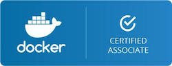

# Docker Certified Associate Exam Prep

The DCA exam is designed to validate that skillset with real world questions designed by experienced Docker practitioners. As the first exam in a comprehensive multi-tiered professional certification program, the DCA serves as a foundational benchmark for real world Docker skills across the container industry.

## My Notes

* [DCA Content](dca_content.md) is a referenced list taken from the official [DCA Study guide](http://tinyurl.com/y79baszg).
* [Domain 1: Orchestration](notes/domain1.md)
* [Domain 2: Image Creation, Management, and Registry](notes/domain2.md)
* [Domain 3: Installation and Configuration](notes/domain3.md)
* [Domain 4: Networking](notes/domain4.md)
* [Domain 5: Security](notes/domain5.md)
* [Domain 6: Storage and Volumes](notes/domain6.md)

## References

* [Official Docker Certification Site](https://success.docker.com/certification)

### Original Author

* [DevOps-Academy-Org/dca-prep-guide](https://github.com/DevOps-Academy-Org/dca-prep-guide0)
* [damhau/dca-prep-guide](https://github.com/damhau/dca-prep-guide/tree/with-documentation-content)
